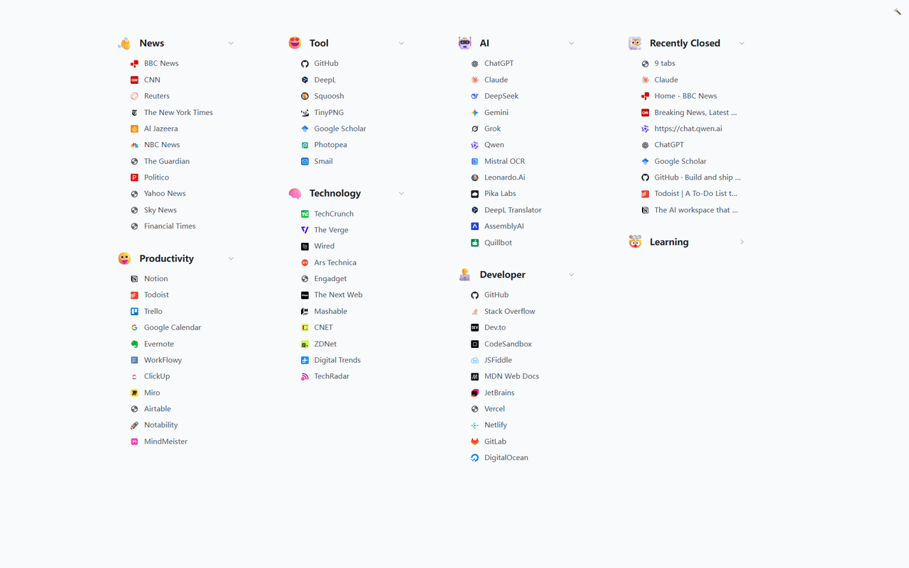

#  Markab - Bookmark New Tab

A new tab extension focused on providing clean, elegant bookmark display experience.

> Never forget your bookmarks again

[Chrome Extensions](https://chromewebstore.google.com/detail/markab/edenohjoklbajppddnaimojnemafnkkg)



## ✨ Features

- **Flat Display** - Shows all bookmark folders in a clean multi-column layout
- **Minimalist Interface** - Focused on bookmark display essentials, removing redundant elements
- **Quick Search** - Instant bookmark search with intelligent matching and keyboard shortcuts
- **Dark Mode Support** - Automatically adapts to system theme preferences
- **Flexible Layout** - Freely reorganize folders by dragging to customize your bookmark layout
- **State Memory** - Intelligently saves layout preferences and folder expand states
- **Animated Emoji** - Add lively animated emoji icons to each folder   

## 🛠️ Development

```bash
bun install

bun run dev
```

## 📝 License

[Apache License 2.0](LICENSE)
